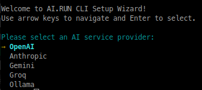
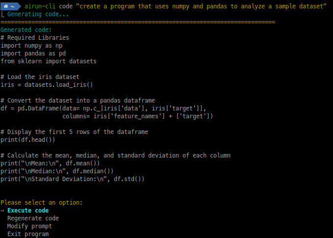
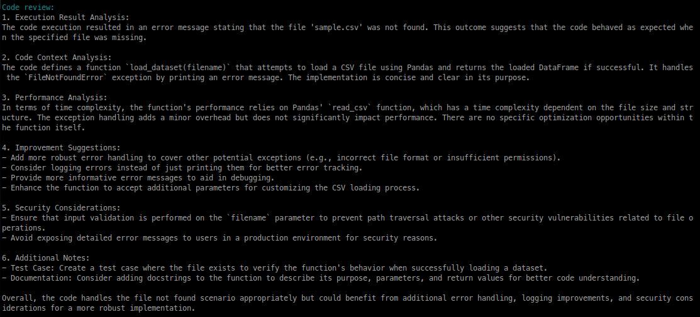
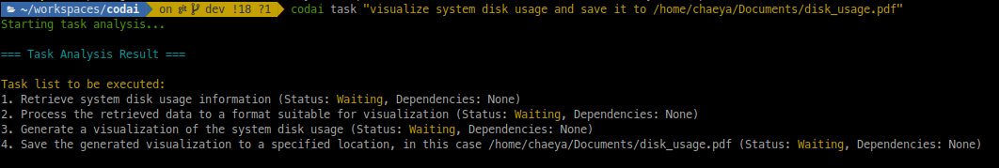
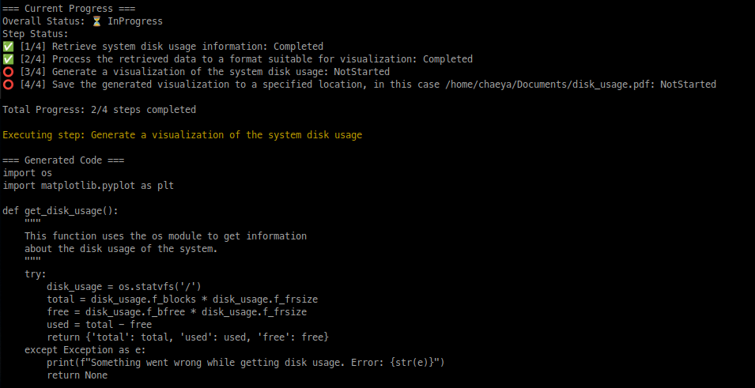
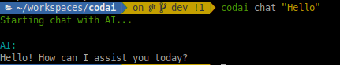
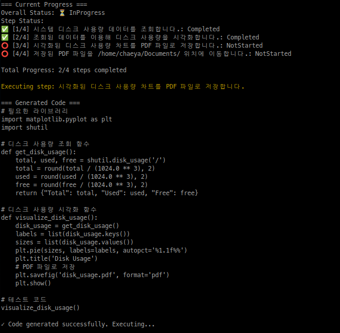

[](https://github.com/hamonikr/codai/releases)
[](LICENSE)
[](https://github.com/hamonikr/codai)
[](https://github.com/hamonikr/codai)
[](https://github.com/hamonikr/codai)
[](https://github.com/hamonikr/codai)

The easiest way to bring powerful AI capabilities to your local machine. Built with Rust for maximum performance and reliability, codai lets you harness the power of various AI models directly from your terminal - no complex setup required.

## 🌟 Key Features

- **🚀 Powerful AI Integration**
  - Multiple AI providers support (OpenAI, Anthropic, Google, Groq, Ollama)
  - Smart context handling and token optimization
  - Real-time cost monitoring and analytics

- **💻 Developer-Centric Tools**
  - Intelligent code generation with context awareness
  - Automated code review and analysis
  - Direct code execution capabilities
  - Multi-language support
  - Built-in cost tracking for each AI provider

- **⚡ Performance & Reliability**
  - Built with Rust for maximum speed and stability
  - Efficient memory management
  - Optimized token usage
  - Automatic context summarization

- **🔧 Easy Setup & Use**
  - One-command installation
  - Zero configuration to start
  - Intuitive CLI interface
  - Cross-platform support

## Why codai?

- **Simple to Install**: One command to install, zero configuration needed to start
- **Multiple AI Providers**: Ready-to-use integrations with leading AI models
  - OpenAI (GPT-4, GPT-3.5)
  - Anthropic (Claude-3)
  - Google (Gemini)
  - Groq (Mixtral)
  - Ollama (Local models)

- **Developer-Focused Features**
  - Instant code generation with context awareness
  - Automated code review and analysis
  - Direct code execution support
  - Multi-language compatibility
  - Cost tracking and usage analytics for each AI provider

- **Smart Resource Management**
  - Optimized context handling for each AI provider
  - Efficient token usage
  - Dynamic conversation management
  - Automatic context summarization
  - Real-time token usage and cost monitoring

## 🚀 Quick Start

### One-Line Installation
```bash
# Linux/macOS
curl -sSL https://raw.githubusercontent.com/hamonikr/codai/main/install.sh | bash
```

### Basic Usage
```bash
# Generate code with AI
codai code "create a web scraper for news headlines" -r

# Get instant programming help
codai chat "explain async/await in Rust"

# Review your code
codai review "path/to/your/code.rs"

# Execute AI-generated code
codai run "create a simple HTTP server"
```

## Screenshots

### Initial Setup


### Usage Statistics


### Code Generation


### Code Review


### Task Analysis


### Task Execution


### Chat


### Internationalization
 

## 🛠️ Requirements

### System Requirements
- Operating System: Linux, macOS, or Windows
- Python 3.7 or higher (with venv module)
- Internet connection (except for Ollama local models)

### API Keys
- OpenAI API key for GPT models
- Anthropic API key for Claude models
- Google API key for Gemini
- Groq API key for Mixtral
- Ollama installation for local models

## 🔧 Installation Methods

### Using Cargo
```bash
cargo install codai
```

### Using Binary Releases
Download pre-built binaries from our [GitHub Releases](https://github.com/hamonikr/codai/releases) page.

### Building from Source
```bash
# Install Rust
curl --proto '=https' --tlsv1.2 -sSf https://sh.rustup.rs | sh

# Clone and Build
git clone https://github.com/hamonikr/codai.git
cd codai
cargo install --path .
```

## ⚙️ Configuration

### Quick Setup
```bash
codai -s  # Interactive setup
```

### Manual Configuration
```bash
# Set API keys
codai config openai_api_key "your-key"
codai config anthropic_api_key "your-key"

# Set preferences
codai config default_provider "openai"
codai config default_model "gpt-4"
```

## 🤝 Contributing

We welcome contributions! Here's how you can help:

1. Fork the repository
2. Create your feature branch (`git checkout -b feature/AmazingFeature`)
3. Commit your changes (`git commit -m 'Add some AmazingFeature'`)
4. Push to the branch (`git push origin feature/AmazingFeature`)
5. Open a Pull Request

## 📝 License

This project is licensed under the Apache License 2.0 - see the [LICENSE](LICENSE) file for details.

## 💬 Support & Community

- 🐛 [Report Issues](https://github.com/hamonikr/codai/issues)
- 📧 Contact: chaeya@gmail.com
- 🌟 Star us on GitHub if you find this project helpful!

## 🙏 Acknowledgments

- Built with [Rust](https://www.rust-lang.org/) for performance
- Powered by leading AI models
- Special thanks to all contributors

## Platform-Specific Differences

### Windows
On Windows, the interactive menu might not be displayed due to the limited terminal capabilities of the default Command Prompt (cmd) and PowerShell. In such cases, settings will be saved automatically.

The configuration file is stored at:
```cmd
%APPDATA%\codai\config.toml
```
(Usually at `C:\Users\username\AppData\Roaming\codai\config.toml`)

To modify settings manually:
1. Open the config.toml file with Notepad or another text editor
2. Modify settings in the following format:
```toml
default_provider = "openai"  # AI provider to use
default_model = "gpt-3.5-turbo"     # Model to use
openai_api_key = "your-api-key-here"  # API key
```

Alternatively, you can install Windows Terminal to use the interactive menu.

### Linux/macOS
Linux and macOS fully support interactive terminals, allowing you to use arrow keys to navigate the menu options. 

## 📸 Features in Action
