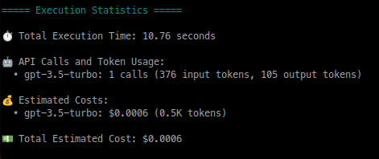
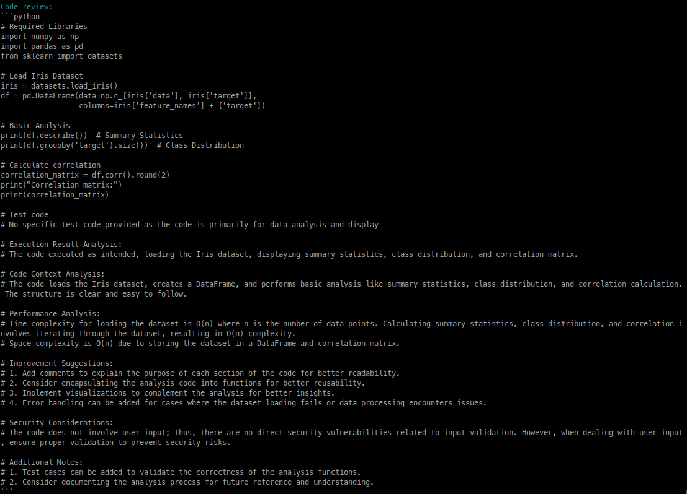
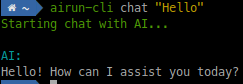
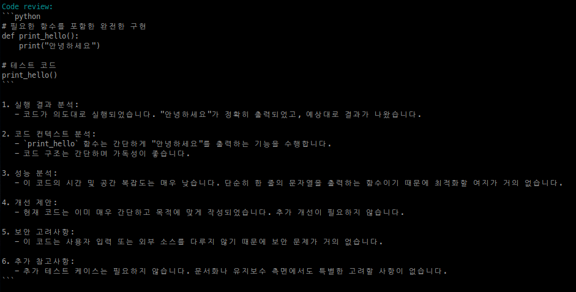

# airun-cli

[](https://github.com/chaeya/airun-cli)
[](https://github.com/chaeya/airun-cli)
[](https://github.com/chaeya/airun-cli)
[](https://github.com/chaeya/airun-cli)

The easiest way to bring powerful AI capabilities to your local machine. Built with Rust for maximum performance and reliability, airun-cli lets you harness the power of various AI models directly from your terminal - no complex setup required.

## Why airun-cli?

- **Simple to Install**: One command to install, zero configuration needed to start
- **Multiple AI Providers**: Ready-to-use integrations with leading AI models
  - OpenAI (GPT-4, GPT-3.5)
  - Anthropic (Claude-3)
  - Google (Gemini)
  - Groq (Mixtral)
  - Ollama (Local models)

- **Developer-Focused Features**
  - Instant code generation with context awareness
  - Automated code review and analysis
  - Direct code execution support
  - Multi-language compatibility
  - Cost tracking and usage analytics for each AI provider

- **Smart Resource Management**
  - Optimized context handling for each AI provider
  - Efficient token usage
  - Dynamic conversation management
  - Automatic context summarization
  - Real-time token usage and cost monitoring

## Quick Start

```bash
# Install (Linux/macOS)
curl -sSL https://raw.githubusercontent.com/chaeya/airun-cli/main/install.sh | sh

# Generate and run code
airun-cli code "create a web scraper for news headlines" -r

# Get programming help
airun-cli chat "explain async/await in Rust"
```

## Requirements

### System Requirements
- Operating System: Linux, macOS, or Windows
- Python 3.7 or higher
  - Linux: `python3` and `python3-venv` packages required
  - macOS: Python with built-in `venv` module (via Homebrew or python.org)
  - Windows: Python with `venv` module (from python.org)
- Internet connection (except for Ollama local models)

### API Requirements
For cloud-based AI providers, you'll need API keys:
- OpenAI API key for GPT models
- Anthropic API key for Claude models
- Google API key for Gemini
- Groq API key for Mixtral
- Ollama installation for local models

### Optional Requirements
- Git (for installation from source)
- Rust toolchain (for building from source)
- Windows Terminal (recommended for better experience on Windows)

## Installation

### From Binary

1. Download the latest release from [GitHub Releases](https://github.com/chaeya/airun-cli/releases)
   
   Choose the appropriate binary for your system:
   
   | Operating System | Architecture | Binary Name |
   |-----------------|--------------|-------------|
   | Linux | x86_64 (64-bit Intel/AMD) | `airun-cli-linux-x86_64` |
   | Linux | ARM64 (64-bit ARM, e.g., Raspberry Pi 4 64-bit OS) | `airun-cli-linux-arm64` |
   | Linux | ARM32 (32-bit ARM, e.g., Raspberry Pi OS 32-bit) | `airun-cli-linux-arm32` |
   | macOS | x86_64 (Intel Mac) | `airun-cli-macos-x86_64` |
   | macOS | ARM64 (Apple Silicon M1/M2) | `airun-cli-macos-arm64` |
   | Windows | x86_64 (64-bit) | `airun-cli-windows.exe` |

2. Extract and install:

```bash
# Linux/macOS
chmod +x airun-cli-*
sudo mv airun-cli-* /usr/local/bin/airun-cli

# Windows
# Move the .exe file to your preferred location
```

### Automatic Installation (Linux/macOS)

The install script will automatically detect your system architecture and install the appropriate binary:

```bash
curl -sSL https://raw.githubusercontent.com/chaeya/airun-cli/main/install.sh | sh
```

Supported architectures for automatic installation:
- x86_64 (64-bit Intel/AMD processors)
- ARM64 (64-bit ARM processors, e.g., Apple Silicon, Raspberry Pi 4 with 64-bit OS)
- ARM32 (32-bit ARM processors, e.g., Raspberry Pi with 32-bit OS)

### From Source

```bash
# Install Rust
curl --proto '=https' --tlsv1.2 -sSf https://sh.rustup.rs | sh

# Clone and Build
git clone https://github.com/chaeya/airun-cli.git
cd airun-cli
cargo install --path .
```

### Uninstallation

```bash
# If installed from binary
sudo rm /usr/local/bin/airun-cli  # Linux/macOS
rm -rf ~/.config/airun-cli/       # Linux
rm -rf ~/Library/Application\ Support/airun-cli/  # macOS
rd /s /q "%APPDATA%\airun-cli"    # Windows

# If installed from source
cargo uninstall airun-cli
```

## Usage

### Basic Commands

```bash
# Show help
airun-cli --help

# Generate code
airun-cli code "create a function to calculate fibonacci numbers"

# Generate and execute code with automatic review
airun-cli code "write a script to check system memory usage" -r

# Start interactive chat
airun-cli chat "explain big O notation"
```

### Usage Examples

1. Code Generation with Python:
```bash
airun-cli code "create a REST API with FastAPI" -l python
```

2. Code Execution with Review:
```bash
airun-cli code "create a sorting algorithm" -r
```

3. Interactive Chat:
```bash
airun-cli chat "how to implement binary search?"
```

## Configuration

### Interactive Setup

```bash
airun-cli -s
```

### Manual Configuration

```bash
# Set API keys
airun-cli config openai_api_key "your-key"
airun-cli config anthropic_api_key "your-key"
airun-cli config google_api_key "your-key"
airun-cli config groq_api_key "your-key"

# Set default provider and model
airun-cli config default_provider "openai"
airun-cli config default_model "gpt-4"

# Configure Ollama
airun-cli config ollama_host "http://localhost:11434"
```

### Configuration File Locations

- Linux: `~/.config/airun-cli/config.toml`
- macOS: `~/Library/Application Support/airun-cli/config.toml`
- Windows: `%APPDATA%\airun-cli\config.toml`

## Screenshots

### Initial Setup


### Usage Statistics


### Code Generation


### Code Review


### Chat


### Internationalization
 

## Contributing

1. Fork the repository
2. Create your feature branch (`git checkout -b feature/AmazingFeature`)
3. Commit your changes (`git commit -m 'Add some AmazingFeature'`)
4. Push to the branch (`git push origin feature/AmazingFeature`)
5. Open a Pull Request

## License

This project is licensed under the MIT License - see the [LICENSE](LICENSE) file for details.

## Support

- GitHub Issues: [https://github.com/chaeya/airun-cli/issues](https://github.com/chaeya/airun-cli/issues)
- Email: hamonikr@gmail.com

## Acknowledgments

- Built with [Rust](https://www.rust-lang.org/)
- Powered by various AI models
- Special thanks to all contributors 

## Platform-Specific Differences

### Windows
On Windows, the interactive menu might not be displayed due to the limited terminal capabilities of the default Command Prompt (cmd) and PowerShell. In such cases, settings will be saved automatically.

The configuration file is stored at:
```cmd
%APPDATA%\airun-cli\config.toml
```
(Usually at `C:\Users\username\AppData\Roaming\airun-cli\config.toml`)

To modify settings manually:
1. Open the config.toml file with Notepad or another text editor
2. Modify settings in the following format:
```toml
default_provider = "openai"  # AI provider to use
default_model = "gpt-3.5-turbo"     # Model to use
openai_api_key = "your-api-key-here"  # API key
```

Alternatively, you can install Windows Terminal to use the interactive menu.

### Linux/macOS
Linux and macOS fully support interactive terminals, allowing you to use arrow keys to navigate the menu options. 
