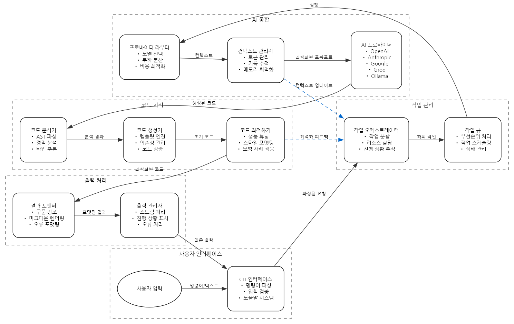

# 기술 아키텍처

## 시스템 개요

codai는 Rust로 작성된 CLI 애플리케이션으로, 다양한 AI 제공업체의 API를 통합하여 개발자들에게 강력한 AI 기능을 제공합니다.

## 시스템 흐름도

시스템은 다음과 같은 주요 컴포넌트들로 구성되어 있으며, 사용자 요청부터 응답까지 다음과 같은 흐름으로 처리됩니다:

1. **사용자 인터페이스 (User Interface)**
   - CLI 인터페이스: 명령어 파싱, 입력 검증, 도움말 시스템
   - 사용자 입력 처리 및 초기 유효성 검사

2. **작업 관리 (Task Management)**
   - 작업 오케스트레이터: 작업 분할, 리소스 할당, 진행 상황 추적
   - 작업 큐: 우선순위 처리, 작업 스케줄링, 상태 관리

3. **AI 통합 (AI Integration)**
   - 프로바이더 라우터: 모델 선택, 부하 분산, 비용 최적화
   - 컨텍스트 관리자: 토큰 관리, 기록 추적, 메모리 최적화
   - AI 프로바이더: OpenAI, Anthropic, Google, Groq, Ollama 연동

4. **코드 처리 (Code Processing)**
   - 코드 분석기: AST 파싱, 정적 분석, 타입 추론
   - 코드 생성기: 템플릿 엔진, 의존성 관리, 코드 검증
   - 코드 최적화기: 성능 튜닝, 스타일 포맷팅, 모범 사례 적용

5. **출력 처리 (Output Processing)**
   - 결과 포맷터: 구문 강조, 마크다운 렌더링, 오류 포맷팅
   - 출력 관리자: 스트림 처리, 진행 상황 표시, 오류 처리

### 데이터 흐름

1. 사용자가 CLI를 통해 명령어 입력
2. CLI 인터페이스가 명령어를 파싱하여 작업 오케스트레이터로 전달
3. 작업 오케스트레이터가 작업을 하위 작업으로 분할하여 작업 큐에 추가
4. 작업 큐가 프로바이더 라우터를 통해 적절한 AI 모델 선택
5. 컨텍스트 관리자가 프롬프트를 최적화하여 AI 프로바이더에 전달
6. AI 프로바이더의 응답이 코드 분석기로 전달되어 처리
7. 코드 생성기가 분석 결과를 바탕으로 코드 생성
8. 코드 최적화기가 생성된 코드를 개선
9. 결과 포맷터가 최종 결과물을 포맷팅
10. 출력 관리자가 사용자에게 결과 전달

### 피드백 루프

- 코드 최적화기는 최적화 결과를 작업 오케스트레이터에 피드백
- 컨텍스트 관리자는 컨텍스트 업데이트를 작업 오케스트레이터에 전달
- 각 컴포넌트는 성능 메트릭과 오류 정보를 모니터링 시스템에 보고

## 핵심 컴포넌트

### 1. CLI 인터페이스 (`src/cli/`)
- 명령어 파싱 및 라우팅
- 사용자 입력 처리
- 출력 포맷팅 및 렌더링

### 2. AI 프로바이더 통합 (`src/providers/`)
- OpenAI, Anthropic, Google, Groq, Ollama 통합
- 토큰 관리 및 최적화
- 컨텍스트 처리 및 요약

### 3. 코드 처리 엔진 (`src/code/`)
- AST 기반 코드 분석
- 언어별 파서 통합
- 코드 생성 및 변환

### 4. 작업 관리자 (`src/task/`)
- 복잡한 작업 분할 및 실행
- 진행 상황 추적
- 오류 처리 및 복구

### 5. 설정 관리 (`src/config/`)
- 환경 설정 처리
- API 키 관리
- 사용자 기본 설정

## 성능 최적화

1. **토큰 관리**
   - 동적 토큰 할당
   - 컨텍스트 압축
   - 캐시 최적화

2. **메모리 관리**
   - Zero-copy 데이터 처리
   - 메모리 풀링
   - 리소스 재사용

3. **병렬 처리**
   - 비동기 작업 처리
   - 작업 큐 최적화
   - 스레드 풀 관리 