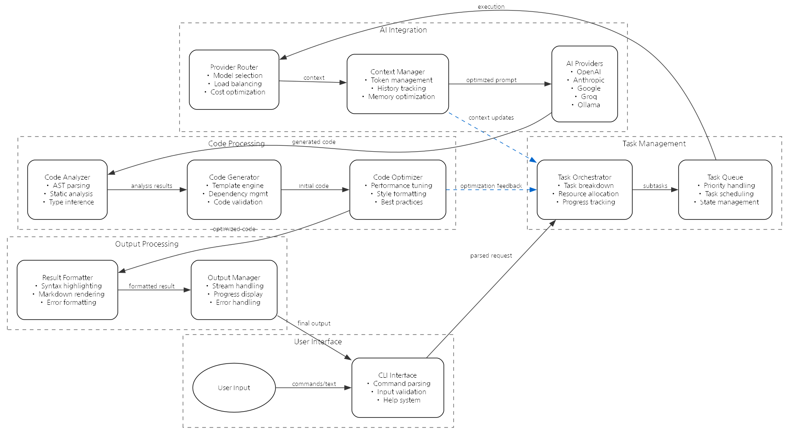

# Technical Architecture

## System Overview

codai is a CLI application written in Rust that integrates various AI provider APIs to deliver powerful AI capabilities to developers. The system is designed for maximum performance, reliability, and extensibility.

## System Flow

The system consists of the following major components and processes requests from user input to response in the following flow:

1. **User Interface**
   - CLI Interface: Command parsing, input validation, help system
   - Initial user input processing and validation

2. **Task Management**
   - Task Orchestrator: Task breakdown, resource allocation, progress tracking
   - Task Queue: Priority handling, task scheduling, state management

3. **AI Integration**
   - Provider Router: Model selection, load balancing, cost optimization
   - Context Manager: Token management, history tracking, memory optimization
   - AI Providers: OpenAI, Anthropic, Google, Groq, Ollama integration

4. **Code Processing**
   - Code Analyzer: AST parsing, static analysis, type inference
   - Code Generator: Template engine, dependency management, code validation
   - Code Optimizer: Performance tuning, style formatting, best practices

5. **Output Processing**
   - Result Formatter: Syntax highlighting, markdown rendering, error formatting
   - Output Manager: Stream handling, progress display, error handling

### Data Flow

1. User enters command through CLI
2. CLI Interface parses command and forwards to Task Orchestrator
3. Task Orchestrator breaks down task into subtasks and adds to Task Queue
4. Task Queue selects appropriate AI model through Provider Router
5. Context Manager optimizes prompt and sends to AI Provider
6. AI Provider's response is processed by Code Analyzer
7. Code Generator creates code based on analysis results
8. Code Optimizer improves generated code
9. Result Formatter formats final output
10. Output Manager delivers results to user

### Feedback Loops

- Code Optimizer provides optimization feedback to Task Orchestrator
- Context Manager sends context updates to Task Orchestrator
- Each component reports performance metrics and error information to monitoring system

## Core Components

### 1. CLI Interface (`src/cli/`)
- Command parsing and routing
- User input processing
- Output formatting and rendering

### 2. AI Provider Integration (`src/providers/`)
- OpenAI, Anthropic, Google, Groq, Ollama integration
- Token management and optimization
- Context handling and summarization

### 3. Code Processing Engine (`src/code/`)
- AST-based code analysis
- Language-specific parser integration
- Code generation and transformation

### 4. Task Manager (`src/task/`)
- Complex task breakdown and execution
- Progress tracking
- Error handling and recovery

### 5. Configuration Management (`src/config/`)
- Environment configuration handling
- API key management
- User preferences

## Performance Optimization

1. **Token Management**
   - Dynamic token allocation
   - Context compression
   - Cache optimization

2. **Memory Management**
   - Zero-copy data processing
   - Memory pooling
   - Resource reuse

3. **Parallel Processing**
   - Asynchronous task handling
   - Task queue optimization
   - Thread pool management 